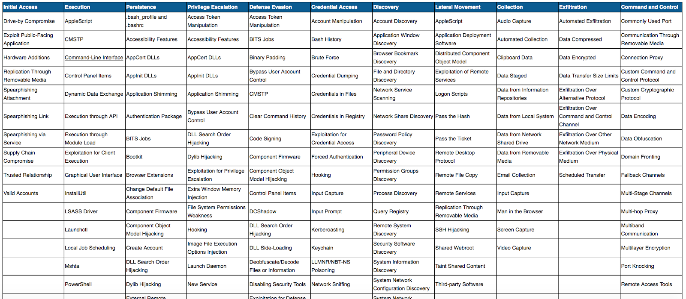

# miniature-parakeet
Personal learning as part of the Introduction for Cybersecurity Course by INFOSEC
Please note: All notes are written for personal purposes only and may not be beneficial to others.

The three objectives:
- Develop python scripts to automate cybersecurity tasks
- Apply Python to meet objectives throughout the cybersecurity attack life cycle
- Automate common cyberattack and defense activities within Python.

Learning is mapped to MITRE ATT&CK and Shield frameoworks.

Why Python?
- Popular language and one of the fastest-growing
- Simple, readable syntax, easy to learn and use, perfect for scripting
- Includes a number of libraries providing a massive amount of built-in functionality (through imports)

